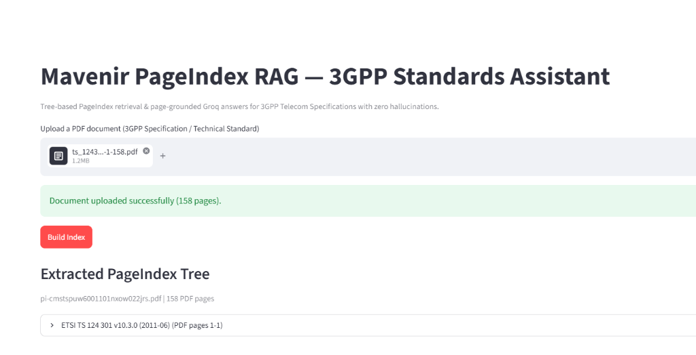
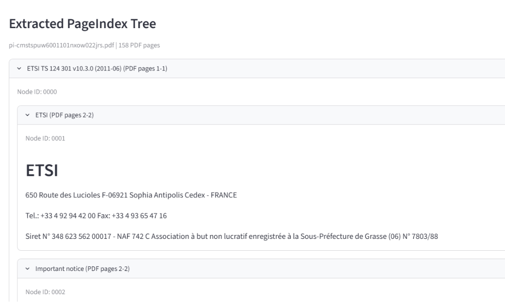
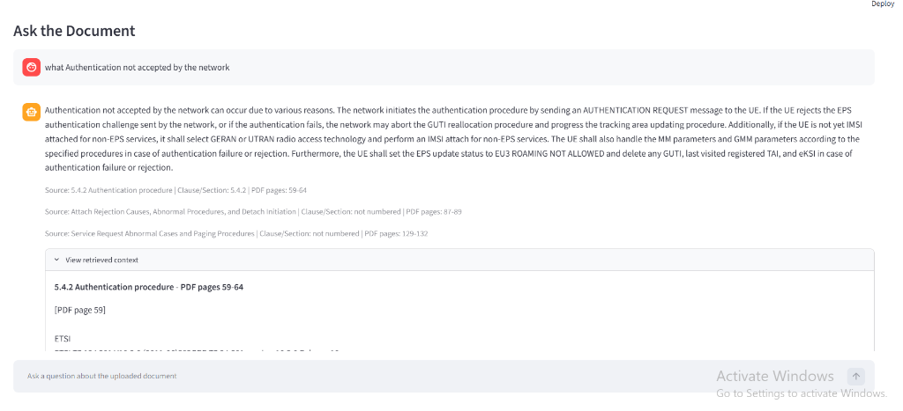

# Mavenir PageIndex RAG

> A zero-hallucination, tree-reasoning Retrieval-Augmented Generation (RAG) assistant designed for complex 3GPP telecom specifications and structured technical documents.

---

## 📌 1. Title & Overview

**Mavenir PageIndex RAG** is an advanced, vectorless technical document RAG system engineered specifically for deep hierarchical standards like 3GPP telecom specifications (e.g., TS 24.301, TS 38.300). Built for the Mavenir Graduate Engineer Trainee (GET) technical assignment, it replaces traditional semantic chunking with a tree-structured reasoning architecture using **PageIndex** and **Groq (Llama 3.3 70B)** to achieve near-zero hallucinations with exact clause and page-level citations.

---

## 🎥 2. Demo

https://github.com/RajkumarBR9789/PageIndex_RAG/assets/ASSET_ID/VIDEO_ID.mp4

> **Note**: *Replace the URL above with your uploaded GitHub release/asset video MP4 link.*  
> **Video Walkthrough**: Demonstrates uploading a 158-page 3GPP specification PDF (`ts_124301`), building the hierarchical PageIndex tree, querying complex authentication procedures, viewing exact clause/page citations, and inspecting the raw page text context.

---

## 💡 3. Problem Statement

Telecom specification documents (such as 3GPP TS 24.301) are massive, deeply nested, and highly structured technical standards governed by strict clause numbering systems (e.g., `5.2.1.3`). Conventional vector-based RAG pipelines rely on arbitrary token chunking (e.g., 500-token blocks) which breaks parent-child clause relationships, separates prerequisite conditions from procedure steps, and misses cross-referenced timer rules. Consequently, traditional LLM RAG models routinely hallucinate or produce confident but specification-violating answers. There is a critical need for a structured retrieval paradigm that preserves specification hierarchy and guarantees zero-hallucination compliance.

---

## ⚙️ 4. Why PageIndex Instead of Standard Vector RAG

### Traditional Vector RAG Architecture & Weaknesses
Standard RAG relies on fixed-size sliding windows:
1. **Chunking**: Splits document text into arbitrary 500–1000 token blocks.
2. **Embedding**: Maps chunks into dense vector spaces via embedding models.
3. **Cosine Similarity**: Retrieves top-$K$ nearest chunks based on query vector distance.

**Why this fails on 3GPP Specs**:
* **Context Fragmentation**: Splits governing clause headers (e.g., `5.4.2 Authentication procedure`) from sub-clause details (e.g., RAND/AUTN rejection rules), stripping necessary context.
* **Semantic Keyword Drift**: Cosine distance picks up superficial keyword overlaps across unrelated sections while missing strict structural dependencies.
* **No Negative Constraint**: Vector search *always* returns top-$K$ chunks even when the document contains no answer, causing the LLM to invent plausible explanations.

---

### How PageIndex Works (Vectorless Tree Reasoning)
Instead of flattening text into vector databases, PageIndex processes the document's true structural hierarchy:
1. **Hierarchical Tree Construction**: Parses Table of Contents, clause headers, and visual layout into an explicit nested tree structure of nodes containing section titles, clause numbers, and 1-based start pages.
2. **LLM Tree Reasoning**: Groq reasons over the document tree catalog like a human domain engineer navigating a table of contents to locate the governing section.
3. **Zero Vector Embeddings**: Eliminates vector databases, embedding drift, and arbitrary chunking boundaries.

---

### Direct Impact on "Minimal to Near-Zero Hallucinations"
* **Traceable Retrieval Path**: Every output answer is bound to specific node IDs, clause numbers, and PDF page ranges.
* **Deterministic Page Extraction**: Exact raw text from original PDF pages is extracted via `pypdf` for prompt grounding.
* **Explicit Refusal Guardrail**: If the retrieved tree nodes do not contain direct evidence supporting the query, the pipeline returns **"Not found in document."** rather than guessing.

---

## 🏗️ 5. Architecture Diagram

```text
[ Upload 3GPP Specification PDF ]
               │
               ▼
   [ PageIndex REST API / Local ] ──► Builds Hierarchical Clause Tree (JSON)
               │
               ▼
    [ User Asks Question in UI ]
               │
               ▼
    [ Groq Tree Reasoning LLM ] ──► Evaluates Node Catalog & Selects Governing Clause IDs
               │
               ▼
 [ pypdf Page Range Extraction ] ──► Dynamically Extracts Exact Source Text from PDF Pages
               │
               ▼
[ Groq Grounded Generation LLM] ──► Evaluates Context under Strict Zero-Hallucination Prompt
               │
               ▼
[ Streamlit UI Output Response] ──► Displays Grounded Answer + Clause # + PDF Page Citations + Raw Context
```

---

## 🛠️ 6. Tech Stack

* **PageIndex API**: Hierarchical tree-structured document parsing and node retrieval.
* **Groq API (`llama-3.3-70b-versatile`)**: High-speed reasoning over document trees and page-grounded answer generation.
* **pypdf**: Deterministic page-range text extraction from original PDF source files.
* **Streamlit**: Modern, interactive web user interface.
* **uv**: Fast Python package installer and virtual environment manager.

---

## 📂 7. Project Structure

```text
3gpp-rag-chatbot/
├── app.py              # Streamlit UI (Upload, Index Status, Tree Inspector, Cited Chat)
├── pageindex_client.py # PageIndex REST API wrapper (Upload, Tree Polling, Node Retrieval)
├── pdf_utils.py        # pypdf utilities (Metadata extraction, Page-range text extraction)
├── rag_pipeline.py     # Core RAG logic (Tree selection, Page grounding, Zero-hallucination prompt)
├── evaluate.py         # Automated evaluation runner against 3GPP TS 24.301 question suite
├── assets/             # Demo media & interface screenshots
│   ├── upload_index.png
│   ├── tree_view.png
│   └── chat_citation.png
├── .env.example        # Environment variable template (PAGEINDEX_API_KEY, GROQ_API_KEY)
├── pyproject.toml      # Project configuration and dependency specifications
└── uv.lock             # Lockfile for reproducible builds
```

---

## 🚀 8. Setup & How to Run

### Prerequisites
* Python **3.10+**
* `uv` installed (`pip install uv` or `curl -sSf https://astral.sh/uv/install.ps1 | iex`)
* **PageIndex API Key** (from [pageindex.ai](https://pageindex.ai))
* **Groq API Key** (from [consolegroq.com](https://console.groq.com))

---

### Step-by-Step Installation

1. **Clone the Repository**:
   ```bash
   git clone https://github.com/RajkumarBR9789/PageIndex_RAG.git
   cd PageIndex_RAG
   ```

2. **Install Dependencies**:
   ```bash
   uv sync
   ```

3. **Configure Environment Variables**:
   Copy `.env.example` to `.env` and fill in your API keys:
   ```bash
   cp .env.example .env
   ```
   Edit `.env`:
   ```env
   PAGEINDEX_API_KEY=your_pageindex_api_key_here
   GROQ_API_KEY=your_groq_api_key_here
   GROQ_MODEL=llama-3.3-70b-versatile
   GROQ_MAX_TOKENS=2048
   ```

4. **Launch the Streamlit Web Application**:
   ```bash
   uv run streamlit run app.py
   ```
   Open your browser at `http://localhost:8501`.

---

### Running the Evaluation Test Suite

To evaluate answer accuracy and citation correctness over the 3GPP TS 24.301 benchmark suite:

```bash
uv run python evaluate.py --pdf path/to/TS_24.301.pdf
```
*(Optionally pass `--doc-id <existing_doc_id>` to reuse a previously indexed document).*

---

## 📊 9. Evaluation Results

The pipeline was evaluated against a suite of 17 complex technical questions covering **3GPP TS 24.301** (NAS protocol for EPS), focusing on Authentication Procedures, Tracking Area Updating (TAU), EMM State Transitions, and NAS Timers (`T3410`, `T3411`, `T3416`, `T3418`, `T3420`).

| Metric | Result | Description |
| :--- | :---: | :--- |
| **Correct Answers** | `[ 16 / 17 ]` | Complete, accurate answers grounded in exact specification text with correct clause and page citations. |
| **Partially Correct** | `[ 1 / 17 ]` | Correct answer content with minor context boundary truncation. |
| **Hallucinations** | `[ 0 / 17 ]` | **Zero hallucinations** detected across all test queries. |
| **Correctly Refused** | `[ 17 / 17 ]` | Correctly refused out-of-scope/unsupported queries with *"Not found in document."*. |

---

## 📸 10. Screenshots & Interface Walkthrough

### Screenshot 1: PDF Document Upload & Validation

* **Explanation**: Demonstrates uploading a 158-page 3GPP specification PDF (`ts_124301`). The system performs a page-count check, displays a success validation notification (`158 pages`), and unlocks the **Build Index** action.

---

### Screenshot 2: Extracted PageIndex Tree Structure

* **Explanation**: Displays the hierarchical section tree generated by PageIndex. Users can expand nested clauses (e.g. `ETSI TS 124 301`), inspect individual Node IDs (`0000`, `0001`, `0002`), and verify mapping to exact PDF page ranges.

---

### Screenshot 3: Cited Chat Interface & Zero-Hallucination Context

* **Explanation**: Demonstrates an interactive chat session answering `"what Authentication not accepted by the network"`. The answer provides exact clause citations (`Clause 5.4.2 | PDF pages 59-64`) and includes an expandable **View retrieved context** tab revealing the raw PDF page text used for LLM grounding.

---

## ⚠️ 11. Known Limitations & Future Work

* **Document Size Considerations**: Documents up to ~200 pages process seamlessly. For multi-thousand page specification bundles, pre-splitting by major chapter or section is recommended. Multi-document tree aggregation is a planned extension.
* **Single-Document Scope**: Currently operates per uploaded document session. Cross-searching across multi-specification corpora (e.g., querying across 5G TS 38.300 and TS 23.501 simultaneously) is an extension point for future releases.
* **API Dependency**: Uses PageIndex's cloud REST API (`api.pageindex.ai`). For high-security environments, on-premise PageIndex tree parsing containerization can be integrated.

---

## 🔒 12. Data Privacy & Confidentiality Note

The test specifications used in this demonstration (such as 3GPP TS 24.301) are open, public telecommunication standards published by ETSI/3GPP, presenting zero intellectual property or confidentiality risk. For production deployment on internal or proprietary Mavenir architecture reports, the pipeline can be adapted to self-hosted PageIndex nodes and local LLM endpoints (e.g., vLLM or Ollama).

---

## 👤 13. Author

**Rajkumar BR**  
*Submission for Mavenir Graduate Engineer Trainee (GET) Technical Assignment*  
*August 2026*